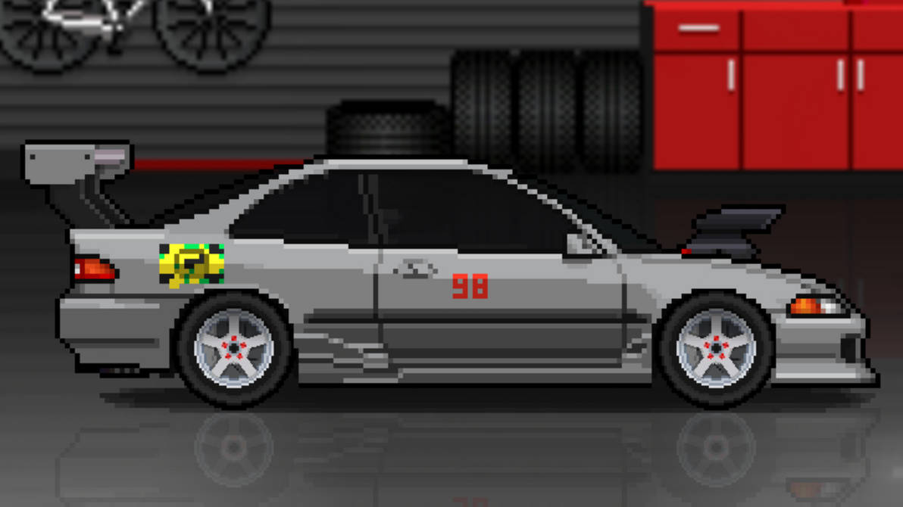

<div align="center">

```text
██╗  ██╗██╗       ██╗     █████╗ ███╗   ███╗     █████╗ ██████╗ ██╗  ██╗██╗
██║  ██║██║       ██║    ██╔══██╗████╗ ████║    ██╔══██╗██╔══██╗╚██╗██╔╝██║
███████║██║       ██║    ███████║██╔████╔██║    ███████║██████╔╝ ╚███╔╝ ██║
██╔══██║██║       ██║    ██╔══██║██║╚██╔╝██║    ██╔══██║██╔══██╗ ██╔██╗ ╚═╝
██║  ██║██║▄█╗    ██║    ██║  ██║██║ ╚═╝ ██║    ██║  ██║██║  ██║██╔╝ ██╗██╗
╚═╝  ╚═╝╚═╝╚═╝    ╚═╝    ╚═╝  ╚═╝╚═╝     ╚═╝    ╚═╝  ╚═╝╚═╝  ╚═╝╚═╝  ╚═╝╚═╝
```

<p align="center">
  
</p>

</div>

<div align="center">
  
</div>

## `01` CURRENT FOCUS

- Cloud Computing
- Full Stack
- Software Development

**◆ Currently Learning**

- `AWS` · `Kubernetes` · `Terraform` · `CI/CD` · `Microservices`
<div align="center">
  
</div>

## `02` TECH STACK

<div align="center">

<table>
  <tr>
    <td align="center" width="50%">
      <h3>Frontend</h3>
      
    </td>
    <td align="center" width="50%">
      <h3>Backend</h3>
      
    </td>
  </tr>
  <tr>
    <td align="center" width="50%">
      <h3>Cloud</h3>
      
    </td>
    <td align="center" width="50%">
      <h3>Tools</h3>
      
    </td>
  </tr>
</table>

</div>

<div align="center">
  
</div>

## `03` GITHUB METRICS

<div align="center">


<br><br>


</div>

## `04` CONNECT WITH ME

<div align="center">

[](https://www.linkedin.com/in/ankcris-letada-525577313/)
[](https://your-portfolio.dev)

</div>

